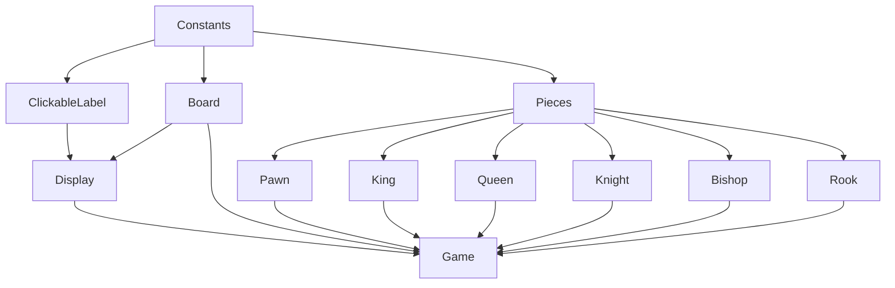

# ChessBot

## Board
Stores the postition of the pieces based on an FEN string provided to the constructor from the parent game.
Can evaluate the position and return a value to determine who is in a more favourable position.

## Game
